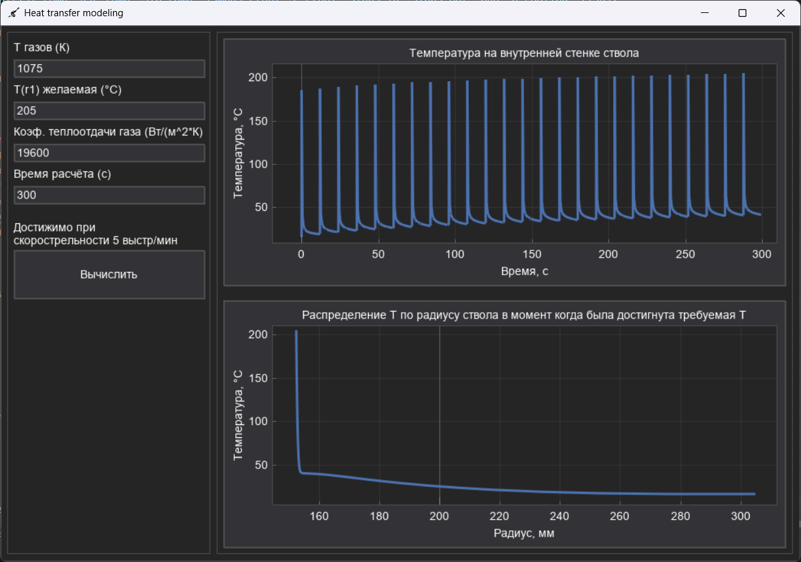

# Моделирование огневого режима орудия ТМ-3-12*

## Описание проекта

Данная программа решает оптимизационную задачу поиска требуемой скорострельности орудия,
путем численного решения дифференциального уравнения нестационарной теплопроводности в поперечном сечении стенки ствола  методом конечных разностей.



## Основные функции

- **Численное решение уравнения теплопроводности** методом конечных разностей
- **Моделирование цикла "выстрел-охлаждение"** для серии выстрелов
- **Оптимизация скорострельности** с учетом тепловых ограничений
- **Визуализация результатов** в удобном GUI

## Замечания

Программу легко адаптировать под любое орудие. Также используются упрощенные математическая и физическая модели!

## Зависимости

- dearpygui

```bash
pip install dearpygui
